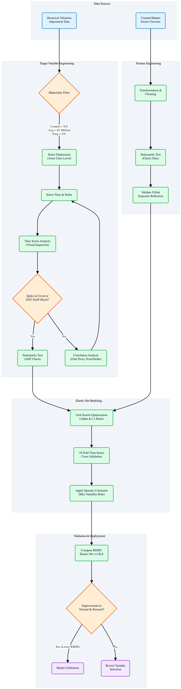

# Adaptive Elastic Net Framework for Regulatory Capital Modeling


## Executive Summary
Financial institutions must demonstrate capital adequacy under stressed market scenarios for prudential valuation and regulatory compliance. This repository serves as a **technical reference implementation** of a high-dimensional stress testing framework designed for Tier 1 regulatory capital adequacy (e.g., Prudent Valuation/AVA). 

It demonstrates a "Next-Generation" architecture that transformes the methodology from static variable selection to dynamic, data-driven feature selection using **Elastic Net Regularization**, specifically engineered to model Volatility Surface Dynamics under regime-switching conditions (e.g., Covid-19, Geopolitical Shocks). It uses equity as the example asset class to show the implementation of using economically justified market and macroeconomic factors to explain the dispersion of market data, enabling transparent identification of primary risk drivers under severe market stress scenarios.

> **Note:** This project is a de-sensitized reconstruction using public market data. It isolates the *methodological innovations* (Algorithm, Validation Logic, Architecture) from proprietary banking infrastructure.


## Architectural Workflow

*Figure 1: Complete model development workflow from variable selection to Automated Calibration.*

## The Industry Challenge vs. Proposed Solution

### 1. The Legacy Problem (Industry Standard)
Traditional regulatory models often suffer from "Curse of Dimensionality" and operational rigidity:
* **Opaque Selection:** Variable selection often relies on static heuristic lists rather than statistical evidence.
* **Stationarity Bias:** Over-differencing data removes "Level" signals critical for identifying stress regimes.
* **Operational Latency:** Manual calibration cycles (Excel-based) typically are error prone and require **hours of effort**, creating model risk and limiting intra-day responsiveness.
- No proper time-series validation or out of sampling forecast.


### 2. The Innovation (This Framework)
This project introduces a **transparent, fundamentals-driven, production-ready development framework** engineered to resolve specific structural inefficiencies in legacy risk modeling:

1.  **Fundamentals-Based Feature Selection:**
    * Instead of "convenience-based" data sampling, this framework uses a rigorous, **Economically Justified Factor Universe**.
    * Variable selection is constrained to fundamentals that have theoretical links to the asset class (e.g., Credit Spreads for Equity Dispersion), ensuring economic interpretability.

2.  **Stress-Validated Target Engineering:**
    * Dependent variables (Dispersions) are not selected arbitrarily. They undergo a **Multi-Stage Filter**:
        1.  **Materiality:** Top contributors to Prudent Valuation (based on occurrence and magnitude of risk exposure).
        2.  **Regime Sensitivity:** Candidates are mathematically validated to ensure they exhibit significant spikes during historical stress events (e.g., COVID-19, April 2025 tariff shock). If a target does not "panic" during a crash, it is rejected iteratively.    
    
3.  **Operational Automation (Latency Reduction):**
    * Replaces manual, spreadsheet-based recalibration with a Python ETL pipeline.
    * **Impact:** Achieves **orders-of-magnitude reduction** in quarterly processing latency while eliminating manual formula errors.
    * **Governance:** enables reproducible, auditable runs essential for regulatory compliance.

4.  **Rigorous Temporal Validation:**
    * Implements **Elastic Net Regularization** within a `TimeSeriesSplit` cross-validation framework.
    * Strictly prevents "look-ahead bias" and evaluates performance on **Out-of-Sample (OOS)** forecasts to ensure true predictive power.

5.  **Universal Regime Robustness:**
    * Unlike approachs that rely on switching models (which requires predicting the regime in advance), this framework identifies a **single, robust feature set** that performs effectively across both "Normal" and "Stressed" conditions.
    * **Benefit:** This eliminates the operational risk of failing to detect a regime shift in real-time, as the model logic remains valid without manual intervention.
    

## Technical Methodology

### 1. Target Variable Engineering (Volatility Surface Dynamics)
The model targets **Equity Cross-Sectional Dispersion** (21-day rolling realized volatility). 
* **Innovation**: Rather than standard volatility, we isolate specific **Term/Strike** coordinates on the volatility surface that exhibit maximum sensitivity to structural breaks.
* **Validation**: Targets are validated via a "Stress Spike Test"—confirming they react significantly to the March 2020 Covid shock and the April 2025 Tariff shock.
* **Iterative Proxy Search:** If a dispersion metric fails to spike during known stress events, it is iteratively rejected for a proxy that captures the true tail risk.

### 2. Modeling Strategy: Elastic Net & Design Decisions

**Primary Model Architecture:**
The framework utilizes **Elastic Net Regression** (combining L1 and L2 regularization) rather than OLS. This choice is driven by three specific quantitative requirements:

* **Sparsity & Selection (L1):** In a high-dimensional macro environment, L1 penalties force irrelevant coefficients to zero. This provides embedded feature selection, isolating the most material risk drivers without manual intervention.
* **Multicollinearity Management (L2):** Financial stress factors (e.g., VIX, Credit Spreads, Put/Call Ratios) are inherently correlated. L2 penalties stabilize coefficient estimates, preventing the model from becoming unstable or overfitting during regime shifts.
* **Economic Signal Preservation (Stationarity):** We prioritize **Regime Sensitivity** over strict Stationarity. While traditional econometrics suggests differencing non-stationary data (e.g., VIX levels), this often removes the "absolute level" signal required to identify a tail event. Elastic Net allows us to retain these level-based indicators while controlling for the resulting variance.

**Hyperparameter Optimization:**
* **Grid Search:** Automated tuning of $\alpha$ (regularization strength) and the L1-ratio to find the optimal bias-variance tradeoff.
* **Temporal Integrity:** Utilizes **10-Fold Time-Series Cross-Validation** (Rolling Origin). This strictly enforces chronological order, ensuring the model is never trained on future data (eliminating look-ahead bias).

**Validation Protocol:**
* **Split Strategy:** 80/20 Chronological Train/Test split.
* **Out-of-Sample (OOS) Evaluation:** Performance is benchmarked on recent unseen data.
* **Regime-Specific Metrics:** RMSE is calculated separately for **Normal Regimes** vs. **Stress Regimes** (top 10% volatility periods) to ensure the model remains robust during tail events.


### 3. Calibration Architecture (Production View)
While this repository focuses on the *Model Development* engine (Feature Selection), the architecture is designed to serve as the upstream input for a **High-Frequency Calibration Module**.

**The Innovation: A Decoupled & Automated Pipeline**
The massive reduction in process latency (from ** hours to minutes**) was achieved by implementing a dual-layer optimization strategy:

#### A. Algorithmic Optimization: "Decoupling"
We separated the computationally intensive task of **Feature Selection** from the high-frequency task of **Parameter Estimation**.
* **Offline Cycle (Monthly/Quarterly):** The Elastic Net engine (this repo) runs full grid search cross-validation to identify the optimal *structure* of risk drivers (e.g., "Equity Dispersion is driven by VIX + Credit Spreads").
* **Online Cycle (Daily/Real-Time):** The pre-selected feature set is serialized into a configuration object. The downstream calibration engine simply loads this config and performs a lightweight convex optimization to update coefficients.
    * *Impact:* Transforms calibration from a heavy $O(N^2)$ search problem into a fast linear algebra operation.

#### B. Infrastructure Modernization: "Atomic Execution"
* **Legacy Constraint:** The previous workflow relied on manual data aggregation in Excel, frequently hitting memory limits and causing application crashes (Operational Failure Points) that required manual restarts.
* **Modernized Solution:** The entire pipeline was migrated to a **Python ETL framework**. Data ingestion, cleaning, and model fitting occur in-memory using optimized libraries (Pandas/NumPy), ensuring **100% process stability** and eliminating manual intervention.

---

## Scope & Scalability


# why each variable makes economic sense as a driver of equity dispersion

This repository utilizes **Equity Dispersion** as the primary Proof of Concept (PoC). However, the architecture is designed to be **Asset-Class Agnostic**:

| Asset Class | Target Variable (Dispersion) | Feature Universe (Inputs) | Status |
| :--- | :--- | :--- | :--- |
| **Equities** | S&P 500 Realized Volatility | VIX, Sector ETFs, Put/Call Ratios | **Implemented** |
| **Credit** | HYG/LQD Spread Dispersion | CDX Indices, Default Swap Spreads | *Supported Architecture* |
| **FX** | G10 Currency Volatility | Interest Rate Differentials (Carry) | *Supported Architecture* |

---


## Performance & Impact Benchmarks

### 1. Predictive Accuracy (RMSE Analysis)
The Adaptive Elastic Net model demonstrates superior **Generalization Capabilities** compared to the OLS Baseline using a single, unified feature set:

* **Normal Regime:** Maintains low error rates by filtering out noise via L1 Regularization.
* **Stressed Regime:** Significantly outperforms OLS during tail events.
    * *Conclusion:* The model successfully identifies risk drivers (e.g., VIX, Spreads) that naturally scale in magnitude during a crisis. This allows a **single model specification** to remain predictive during sudden shocks (e.g., Covid-19) without requiring manual recalibration or regime-switching logic.

### 2. Operational Efficiency
* **Automation:** End-to-end Python pipeline eliminates manual data aggregation.
* **Scalability:** The modular architecture supports rapid deployment across multiple asset classes (Equity, Credit, FX) using the same underlying logic.

---

## Design Decisions & Economic Rationale

### Why Daily Data?
Monthly data reduces sample size (~36 observations for 3-year lookback), making lags/rolling windows uninformative. **Daily frequency** is chosen to maximize sample size and capture lag dynamics.

### Why 21-Day Rolling Volatility?
Standard financial proxy for monthly realized volatility; aligns with regulatory reporting conventions (e.g., VaR windows).

### Stress Period Identification
* **COVID (March 2020):** Primary reference for maximum volatility spike.
* **April 2025 Tariff Shock:** Modeled as a sharp selloff triggered by trade policy shifts, used to validate the model's sensitivity to geopolitical structural breaks.

---

## Repository Structure

```
Stressed-Model-development/
│
├── src/
│   ├── config.py           # Model hyperparameters
│   ├── data_ingestion.py   # Wrapper for yfinance/FRED (Proxy for Internal Data Lake)
│   ├── features.py         # Rolling window & lag generation
│   ├── model.py            # ElasticNetCV & TimeSeriesSplit logic
│   └── calibration_research.py # EXPERIMENTAL: Convex Optimization Calibration
│
├── notebooks/
│   └── Stressed_Model_Development.ipynb # Interactive Analysis & Visualization
│
├── figures/
│   ├── Adaptive_Elastic_Net_Flowchart.jpg
│   ├── actual_vs_pred_vol_test.png
│   └── elastic_net_top_coefs.png
│
├── requirements.txt
└── LICENSE                 # MIT License

```

---

## Installation & Usage

### Prerequisites
- Python 3.7.6+
- pip or conda

### Setup

Clone repository
git clone https://github.com/YCJG/Stressed-Model-development.git
cd Stressed-Model-development

Install dependencies
pip install -r requirements.txt

Run Jupyter notebook
jupyter notebook notebooks/"Stressed Model Development.ipynb"


### Data Sources

The data ingestion pipeline (`src/data_loader.py`) is architected to stream historical financial time-series from standard public APIs, ensuring the project is fully reproducible out-of-the-box.

* **Market Data:** `stooq` (via `pandas_datareader`)
    * **Scope:** Equity Indices (e.g., S&P 500), Volatility proxies, and Sector ETFs.
    * **Purpose:** Provides daily Open-High-Low-Close (OHLC) data required for volatility estimation and regime identification.

* **Macroeconomic Fundamentals:** `fred` (Federal Reserve Economic Data)
    * **Scope:** Benchmarks such as Federal Funds Rates, Credit Spreads (e.g., Moody's Baa-10Y), and Inflation metrics.
    * **Purpose:** Provides the fundamental economic drivers required for the Elastic Net feature selection process.

> **Architecture Note:** The data loader (`src/data_loader.py`) utilizes an **Interface Pattern**, decoupling the fetching logic from the modeling engine. This ensures the framework can be easily adapted to ingest data from local SQL databases, CSV files, or alternative providers (e.g., Bloomberg/Refinitiv) without modifying the core regression logic.


---

## License

This project is licensed under the MIT License - see the [LICENSE](LICENSE) file for details.

---


## Disclaimer: 
**Technical Demonstration Only.** This is a personal research project exploring quantitative risk methodologies. It is not derived from, nor does it contain, any proprietary code, data, or intellectual property from any financial institution.

---
